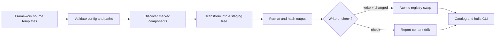

# Build architecture

`@hulla/ui` is a source transformer, not a runtime component dependency. Its job is to turn a
library-authoring tree into a self-contained registry that another tool can copy into an
application.

## Source discovery

Each configured framework may have one or more input directories. Their immediate child
directories become components only when they contain a `package.json` marker. Multiple inputs may
be used to compose a registry, but the same component name cannot appear twice for one framework.

All files inside a marked component are emitted. Framework suffixes are removed from generated
filenames and local module specifiers, so `button.react.tsx` becomes `button.tsx` and
`index.button.react.tsx` can export from `./button`.

Shared and framework-specific `copyFiles` are added to the same plan. Destination collisions are
errors, including attempts to overwrite generated framework `package.json` or `tsconfig.json`
files.

## Transformation

TypeScript's parser is used for JavaScript and TypeScript syntax. Astro frontmatter and Vue/Svelte
`script` blocks use the same script transform. Text matching is not used to identify imports or
`resolve(...)` calls.

`resolve(...)` is a compile-time marker. The referenced exported initializer is placed directly in
the generated component, its required imports are preserved, and the marker plus now-unused source
imports are removed. The complete contract is documented in
[Component authoring](./component-authoring.md#inlining-shared-values-with-resolve).

Prettier formats every generated source file with the Astro and Svelte plugins before comparison.

## Deterministic and atomic output

Every run creates a fresh staging directory next to the configured output root. The generator then:

1. Renders every framework tree, shared file, package file, and TypeScript config.
2. Writes `ui.config.ts` with component-to-framework availability.
3. Hashes staged files and writes `ui.manifest.json`.
4. Compares SHA-256 hashes with the current output.
5. Renames the complete staging tree into place only when content changed.

No timestamp or incremental cache participates in correctness. If discovery, transformation,
formatting, or writing fails, the existing output remains untouched. A successful full-tree swap
also prunes files deleted from source.

The manifest does not hash itself, which avoids a circular digest. Its `files` object covers every
other emitted file.

## Check mode

`uigen --check` renders the same staging tree but never replaces output. It fails with a categorized
list of missing, changed, and unexpected files. CI uses this after the normal build and test suites
to enforce that source and committed generated output are synchronized.

## Isolation boundaries

Configuration validation prevents:

- absolute or traversing input, copy, and framework-output paths;
- a framework output from being the registry root;
- overlapping framework output directories;
- generated output from containing or overlapping component inputs;
- copied source files from reading back out of generated output;
- symbolic links inside component source trees.

Generated framework TypeScript configs are self-contained instead of extending monorepo-only
configuration. The `check-generated` script copies each framework tree into a temporary project,
links dependencies, and runs the native checker only for frameworks that currently contain
components.
